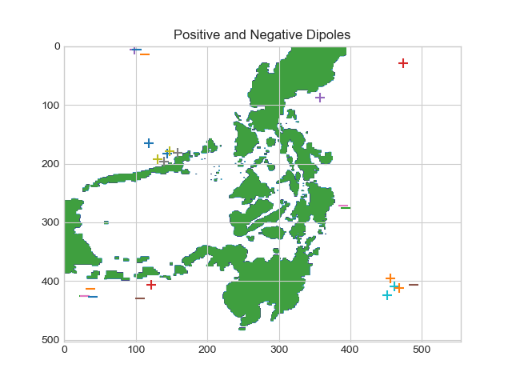

# Ocean Flow - A Gaussian Process Model

The ocean is a wonderous place - it's mystery

### Step 1 - The Data
The data measures ocean flow velocity in U (east-west) and V (north-south) directions in an approximately 1500 km x 1500 km grid in the Philippines.

The data comes in the form of 200 csv files, each of which contains a 504 x 555 grid of velocity data, and one mask file that differentiates land and water.

There are 100 csv files for each direction U & V, and each file represents a particular unit in time. We assume that the time points are equally spaced, and that measurements are taken at consistent (x, y) coordinates. This data is loaded into two, 3-D NumPy arrays (x, y, t). Velocity on land is entered as 0.

### Step 2 - Streamplots Visualization

It's hard to get a sense of what we are actually looking at here with this data. Let's visualize what the ocean flow looks like using Matplotlib's Streamplots and Animation functionalities. We also weight the "arrows" by the velocity, so we see where the current is strongest and how it changes over time.

### Step 3 - Dipoles & Correlation

The [Indian Ocean Dipole]( https://en.wikipedia.org/wiki/Indian_Ocean_Dipole) is a temperature anomaly in which the eastern and western regions of the Indian Ocean are extremely negatively correlated, which has far-reaching climate impacts that can be felt as far as South America through its impact on El Nino.

Source - Wikipedia

Nothing this impactful exists in the data we have, but it is a good exercise to see if we can come up with areas that are positively or negatively correlated. The algorithm I implemented uses random sampling instead of calculating a (504x555)2 correlation coefficients and is explained in detail in the docstring of the function titled find_dipoles in OceanFlow.py

### Step 4 - A Plane Crash!

### Step 5 - Gaussian Priors

### Step 6 - Gaussian Posterior

### Step 7 - Visualizing Kernels as Covariance Matrices

### Step 8 - K-Fold Cross-Validation & Log Likelihood

### Step 9 - Hyperparameter Optimization

### Step 10 - Optimized Gaussian Posterior

##### Sources
