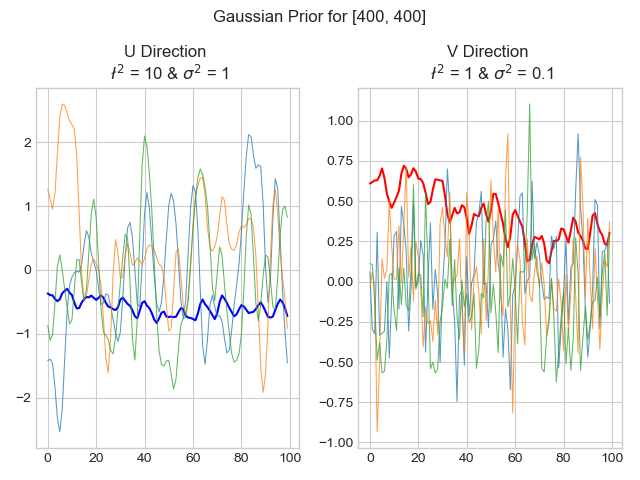
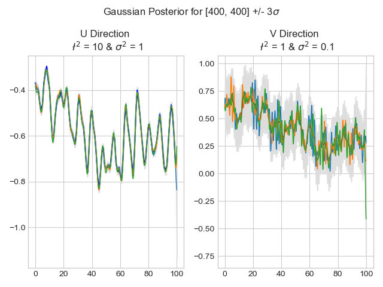
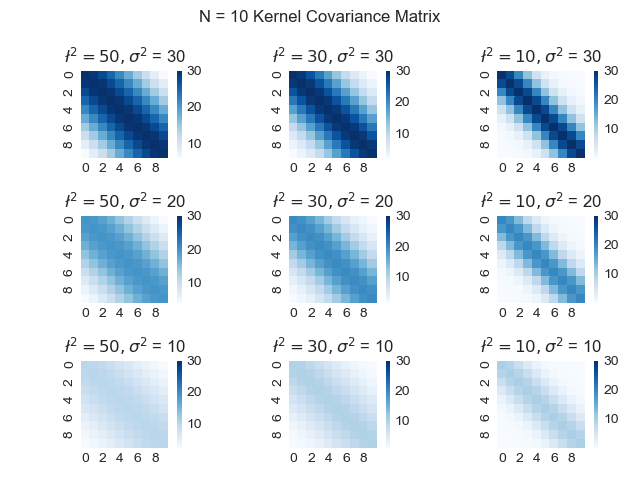
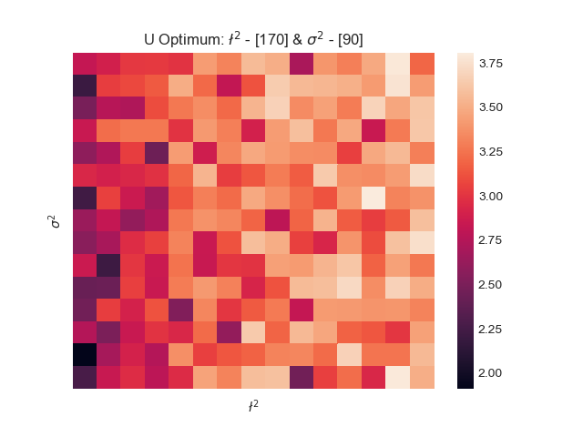
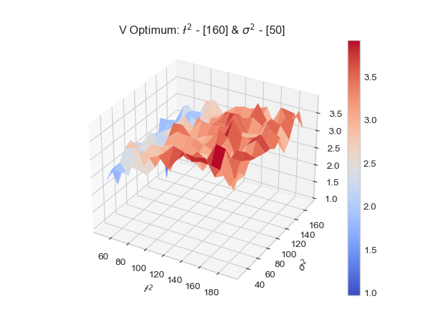
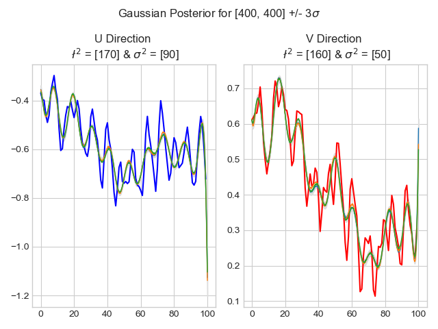

# Ocean Flow - A Gaussian Process Model

The ocean is complicated, expansive, and powerful. It is also random and mysterious. This analysis tries to fit a model to this randomness using a machine learning technique called a Gaussian Process Model.

Pexels.com

#### ELI5 - What is a Gaussian Process?
You have some data, and there are an infinite number of functions that can fit this data. It could be a straight line, it could be a quadratic curve, it could be a sine wave. Some are better than others. The assumption is that the choice of *function* relative to its *fit* conforms to a Gaussian probability distribution. But we can do better than that - it is actually a conditional Gaussian distribution because it is *conditional* on the known (or training or seen) data points. In other words, the known data gives us some knowledge to construct a joint Gaussian distribution from which to sample.

Okay, maybe ELI18

### Step 1 - The Data
This data set contains ocean flow velocity in U (east-west) and V (north-south) directions spanning an approximately 1500 km x 1500 km grid over the Philippines Archipelago.

The data comes in the form of 200 csv files, each of which contains a 504 x 555 grid of velocity data, and one mask file that differentiates land and water.

There are 100 csv files for each direction, and each file represents a particular unit in time. We assume that the time points are equally spaced, and that measurements are taken at consistent (x, y) coordinates. This data is loaded into two, 3-dimensional NumPy arrays (x, y, t). Velocity on land is 0.

### Step 2 - Streamplots Visualization

It's hard to get a sense of what we are actually looking at here with this data. Let's visualize what the ocean flow looks like using Matplotlib's Streamplots and Animation functionalities. We also weight the "arrows" by the velocity, so we see where the current is strongest and how it changes over time.

### Step 3 - Dipoles & Correlation

The [Indian Ocean Dipole](https://en.wikipedia.org/wiki/Indian_Ocean_Dipole) is a temperature anomaly in which the eastern and western regions of the Indian Ocean are extremely negatively correlated, which has far-reaching climate impacts that can be felt as far as South America through its impact on El Nino.

Nothing this impactful exists in the data we have, but it is a good exercise to see if there are some long-range correlations in this data. The algorithm uses random sampling instead of calculating a (504x555)2 correlation matrix and is explained in more detail in the docstring of the function titled find_dipoles in OceanFlow.py

### Step 4 - A Plane Crash!

Imagine there is a hypothetical plane crash in the ocean near the Philippines. A search party knows the location of the accident, but some time has elapsed. Where would be the best place to look after time T = t? We can build a simulation of the ocean flows by using the algorithm described in the docstring of plane_crash in OceanFlow.py

For a plane crash at point [400, 400] with an assumed variance of 10 for x and y directions.

### Step 5 - Gaussian Priors

In the last step, we made a pretty large assumption about the interval of the time steps. What if we only had data every 3 days or longer - we would need a model that can interpolate this noisy data. The typical method that might come to mind is some kind of regression, but it's obvious after looking at the random, cyclic nature of the data that we need a more flexible method.

Enter Gaussian Process, a non-parametric approach that "defines a prior over functions, which can be converted into a posterior over functions once we have seen some data (K. Murphy)"

Rasmussen & Williams explain

> A Gaussian process is a generalization of the
Gaussian probability distribution. Whereas a probability distribution describes
random variables which are scalars or vectors (for multivariate distributions),
a stochastic process governs the properties of functions. Leaving mathematical
sophistication aside, one can loosely think of a function as a very long vector,
each entry in the vector specifying the function value f(x) at a particular input
x. It turns out, that although this idea is a little naïve, it is surprisingly close
what we need. Indeed, the question of how we deal computationally with these
infinite dimensional objects has the most pleasant resolution imaginable: if you
ask only for the properties of the function at a finite number of points, then
inference in the Gaussian process will give you the same answer if you ignore the
infinitely many other points, as if you would have taken them all into account!

The key idea here is that if two values are deemed to be similar by the kernel covariance matrix (more on that later), then the outputs of those values in the function should also be correlated. In other words, if two instances in time are close together, their resulting flow velocity should be similar. Sounds intuitive, right? We just have to find the joint probability distribution over the functions. Our known, truth, or seen data are the data in the 3-D matrices, and any unknown or unseen data are any values in between (eg - we know the flow at t=4 and t=5, but t=4.5 is "unseen").

Ocean flow is a great candidate for being modeled by a Gaussian process because the noisy signal requires a more unconstrained approach to modeling. Ocean flow is a function of numerous random elements like temperature, barometric pressure, cloud cover, etc. The sum off all these yields Gaussian distribution ([Central Limit Theorem](https://en.wikipedia.org/wiki/Central_limit_theorem)).

The Gaussian prior is sampling data from a Gaussian distribution with mean = 0 and a variance specified by the kernel covariance matrix, which is constructed with two hyperparameters: l2 and σ2 or length scale and variance. It is the model *before* the joint distribution is created from the training data.

These appear to be just noisy trends, but the hyperparameters chosen clearly have a large impact on the model even without any data. We'll get into this in step 7.

### Step 6 - Gaussian Posterior

The Gaussian posterior are values sampled from the joint probability distribution of the functions of seen and unseen data. Some pretty detailed linear algebra gets us to this point, and if you are curious, you can read more about it in the sources listed at the end of this README.

We are now continuously sampling from a joint distribution that takes into account the ground truth data to get values at a much higher granularity.

Let's look at the same posterior model using the same hyperparameters as before.

A definite improvement!

However, these are actually pretty terrible models. The first is definitely overfitting the data and would be quite inflexible, and the second one is much too noisy. We need to optimize the hyperparameters to get a best-fit model, but first we need to look more closely at how they impact the covariance matrix.

### Step 7 - Visualizing Kernels as Covariance Matrices

The covariance matrix is the multivariate extension to the variance specified in a typical Gaussian distribution. Kernels are essentially a similarity metric and are therefore typically used as covariance matrices in machine learning (gross over-simplification - a lot of mathematical proof behind this).

The kernel function will input an Nx1 matrix and return a symmetric, semi-definite NxN matrix and with each *(i, j)* entry equal to the covariance between points *(i, j)*. For cross-covariance, the input is an Nx1 and Mx1 matrix that returns a triangular NxM covariance matrix.

In this particular model, I chose to use a radial basis function kernel, which has two hyperparameters. The l2 or length scale term indicates how fast the covariance decays as a function of the squared distance between the points, and σ2 determines the variance at the diagonals. This is visualized below in the grid of heatmaps, which shows a N=10 kernel with varying hyperparameters.

"

[RBF Kernel](https://en.wikipedia.org/wiki/Radial_basis_function_kernel) - description of the kernel used in this model

[Covariance](https://en.wikipedia.org/wiki/Covariance_function) - General information about covariance

### Step 8 - K-Fold Cross-Validation & Log Likelihood

One method of hyperparameter selection is to perform a [K-Fold Cross-Validation](https://scikit-learn.org/stable/modules/generated/sklearn.model_selection.KFold.html), which leaves out a 'fold' of the training data and calculates how well the model performs.

Source: Rebecca Patro - Towards Data Science

But wait, what exactly is the error function here - how do we gauge how well the model performs? Enter maximizing the log-likelihood - this metric tells us the [logarithm of the] likelihood of seeing the posterior function from each iteration of the cross-validation, given the known training data, the training covariance matrix, and the cross-covariance matrix between the training and [artificially] unseen data. It also takes into account both the model-fit and model-complexity. The implementation can be seen in the get_log_likelihood function in OceanFlow_utils.py

[Literature on log likelihood](http://www.gaussianprocess.org/gpml/chapters/RW5.pdf)

### Step 9 - Hyperparameter Optimization

Now that we have the framework of cross-validation and log likelihood estimation, optimization is straightforward. We grid search over a range of l2 and σ2, which is implemented in the hyperparameter_optimization function.

Below is a heatmap of log likelihoods with varying length scales and variances for the U direction. There's no monotonic increase and many, many local optimums. There are probably quite a few parameters that would give decent models, and what we found is likely not even the global maximum likelihood.

This 3-D view of log likelihood in the V direction as a function of hyperparameters shows a *general* directional improvement with longer length scales.

### Step 10 - Optimized Gaussian Posterior

Finally, we have the parameters that will give us the best fit. Let's plot the Gaussian posterior from Step 6.

This is it! This is our model for the point [400, 400]

We could fit a model for every single point in the grid and have continuous estimates of the flow of the ocean in this entire 1500 km x 1500 km grid.

###### Sources

[Katherine Bailey blog post](https://katbailey.github.io/post/gaussian-processes-for-dummies/) - If you want a slightly more in-depth version

[Gaussian Process for Machine Learning by Rasmussen & Williams](http://www.gaussianprocess.org/gpml/chapters/) - If you want the entire textbook

Credit to MITx - Data Analysis: Statistical Methods & Computation for this data and the skills to perform this analysis.
